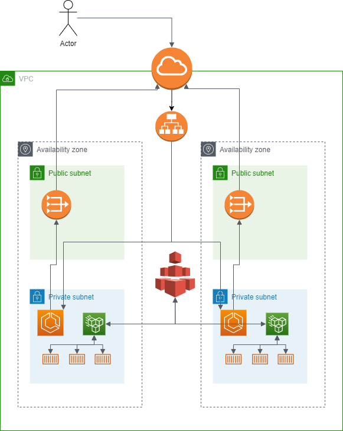

# flask-api-revolut
Home assignment for Revolut DevOps Engineer position.

## Objectives
1. Design and code a simple application that exposes specific API endpoints.
2. Produce a system diagram of the solution deployed to the cloud.
3. Write configuration scripts for building and no-downtime production deployment.

#### 
## System Design
A sketch of the cloud architecture, deployed using Terraform.
  

## How to Run

This is a home assignment for demonstration purposes with some private components e.g. ECR repository that stores the Docker image and therefore can't be ran publicly. 

## Considerations

### Infrastructure design
The design is a relatively simple yet secure one. Incoming requests hit the Internet Gateway before reaching the Application Load Balancer that is spread across both Public Subnets. The ALB then routes the request to one of the running ECS containers in the respective Private Subnet. For outgoing requests, since the ECS containers are in Private Subnets, a NAT Gateway is required to connect to the internet. These live in the defined Public Subnets and route requests out. 

### Data Persistence
Data of current users needs to persist outside of the ECS containers. An EFS instance is defined along with Mount Targets in each Private Subnet. These allow the file system to be mounted to the containers. 

Considered using DynamoDB but opted for EFS for simplicity. DynamoDB would involve setting up VPC Endpoints whereas with EFS we simply define mount points in the private subnets where the ECS containers live. 

### Monitoring
With ECS, we can easily set up monitoring alongside in the form of AWS managed Cloudwatch or containerized Prometheus or other.

### Scalability
The service is highly scalable thanks to ECS. We can define how many containers we'd like to be running at any one time. This can be adjusted dynamically by introducing auto-scaling to match traffic demands.

### Security
The solution is secure given that the deployed application lives in private subnets. There are also security groups defined with limited inbound rules. We can lock down these security groups even futher by limiting requests from known subnets within the VPC. The Load Balancer is listening on port 80, which is an unsecure protocol, unlike HTTPS on port 443. Given the previously mentioned setup, this isn't an immediate risk, but it does allow potential for attacks. 

The deployment workflow accesses the AWS private ECR repository using secrets stored in Github. This is a secure method of authentication. Other services such as Hashicorp Vault can also be used.

### Availability
The service is spread across two AZs in a single region, each with an X number of containers behind an ALB. It is reliable to an extent, but it is not uncommon for entire regions to go down. We can increase availability by multiple factors by using all three available AZs, going multi-region and even multi-cloud.

### Code Deployments
Each time a code change is pushed to the remote repo, the defined [Github Actions workflow](https://github.com/harry-reid94/flask-api-revolut/blob/main/.github/workflows/flask-image.yml) rebuilds the image and pushes to a private repository in ECR. We can also add a task into the workflow to deploy the new task definition.

### Cost Efficiency
ECS comes at an extra cost to traditional EC2 servers, but also handles a lot of the operational complexity of container orchestration so most likely works out cheaper when taking operational costs into account. Could use a service outside of AWS managed services like Kubernetes. 

Github actions is not free for private repositories, would need to analyse cost before opting to use it. Otherwise could use open source deployment tools like Jenkins.

### Toolkit
Flask is a super web framework for developing simple APIs. I can't think of a better tool to use for this type of task, especially given my experience with Python. Docker is another easy choice, rapidly increasing deployment velocity and ease of maintenance. For the cloud provider, I went with AWS again due to my level of experience with it. 

Choosing the cloud components was probably the biggest decision to make. As previously mentioned, there were multiple choices for file storage - S3, DynamoDB, EFS, EBS etc. For this particular task EFS seemed the most fitting, given the ease at which we can mount files to containers. For services like DynamoDB, the code would need to be modified to include read/write commands to the database. Opted for ECS over EKS or a self managed Kubernetes function purely for simplicity, but given more time the solution could well be different.

Github actions is free for public repositories so made sense within this scope. Having never used it, I was massively impressed with it. The interface did 90% of the work for me. I'm not sure how costly it is for enterprise solutions, but something I would definitely look at using in the future.

Infrastructure provisioning was again an easy choice, with Terraform being the most widely adopted tool.

## Areas of Improvement
- Modularize Terraform resources
- Variablize Terraform more!
- Introduce a monitoring stack
- Auto-scaling
- Switch to DynamoDB for JSON users storage
- Multi-cloud with a CDN on top
- Limit security group CIDRs to defined subnets
- Enforce HTTPS requests
- Include app usage in README
- Be runnable publicly
